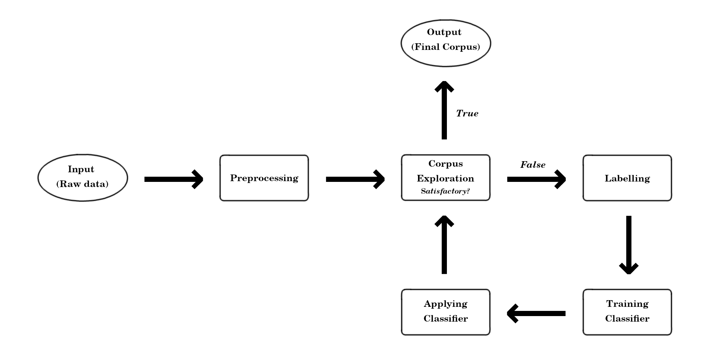

# Philosophical Writing in Early New Zealand Newspapers
## Corpus Creation Workflow

Joshua Black
University of Canterbury
joshua.black@canterbury.ac.nz
black.joshuad@gmail.com

## Overview

This repository contains a series of Jupyter notebooks which together present a method for creating corpora for digital humanities research from large datasets of METS/ALTO files of the sort generated in many newspaper digitisation projects.

The origin of this method is in a project to investigate philosophical discourse in early New Zealand newspapers. Here 'early' is taken to mean pre-1900. This definition was adopted on purely pragmatic grounds: in 2019 the National Library of New Zealand Te Puna Mātauranga o Aotearoa released a large dataset of English-language newspaper content up to the year 1899 ([details here](https://natlib.govt.nz/about-us/open-data/papers-past-metadata/papers-past-newspaper-open-data-pilot)).

## The Method

The method is summarised in the following image:

Each stage has a notebook in the `Notebooks` directory. The model fit and application stages in the same notebook.

## File Structure

Each stage of the method described above has its own worksheet in the `Notebooks` directory. The names of these should be self-explanatory.

Other directories:

- `Corpora`: directory for candidate corpora.
- `Dataset`: a directory to put the full national library dataset and the processed data.
- `Labels`: contains labels for the first iteration of the process.
- `Classifiers`: contains a classifier trained on the first iteration of labels.
- `TopicModels`: contains an LDA model generated in the first iteration of the corpus exploration process as set out in the relevant notebook in the `Worksheets` directory.
- `Dictionaries`: contains a `gensim` dictionary used during the first iteration of corpus exploration.
- `Pickles`: Some pre-generated metadata for the early New Zealand newspaper dataset.

The file `packages_list.txt` contains all packages in the anaconda environment used in the most recent run of these notebooks. It can be used to install all required packages ([see here](https://docs.conda.io/projects/conda/en/latest/commands/list.html)).

## Content Files

Processed data is available [here](https://mega.nz/folder/wPYxQKxS#7LcrbfkHz4fN-uyN6Zvviw) (place in the `Dataset` directory), sample candidate corpora are available [here](https://mega.nz/folder/wPYxQKxS#7LcrbfkHz4fN-uyN6Zvviw) [here](https://mega.nz/folder/YbZlQCoK#H9PbnjJTHXDSFBmPjjemSg) (place in `Corpora` directory).

 
## Other links

Sample results and pre-generated cooccurrence networks from an earlier version of this project are available [here](https://nz-newspaper-philosophy.herokuapp.com/).